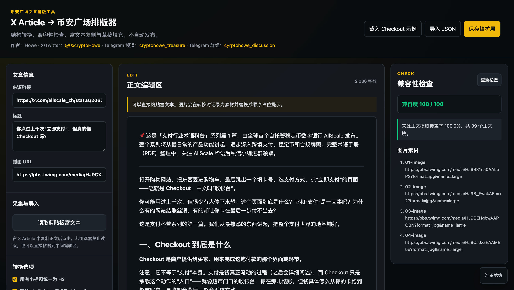
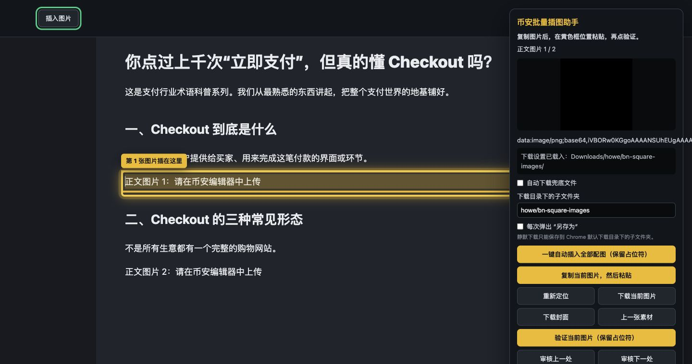

# 币安广场文章排版工具

把 X Article 迁移到币安广场文章编辑器，并把 X 推文迁移到币安广场短帖输入框的本地工作流工具：

`X Article 采集 -> 币安格式转换 -> 兼容性检查 -> 填入文章草稿 -> 批量插图 -> 人工审核 -> 手动发布`

`X 推文采集 -> 填入币安广场推文输入框 -> 人工上传图片/审核 -> 手动发布`

扩展不会自动点击“发布”。



## 作者信息

- 作者：Howe
- X/Twitter：[@0xcryptoHowe](https://x.com/0xcryptoHowe)
- Telegram 频道：[cryptohowe_treasure](https://t.me/cryptohowe_treasure)
- Telegram 群组：[cyrptohowe_discussion](https://t.me/cyrptohowe_discussion)

## 目录说明

- `extension/`：Chrome 扩展源码。开发者模式加载这个文件夹。
- `docs/images/`：README 使用的说明截图。
- `scripts/build-release.sh`：生成可分发 zip 安装包。
- `dist/`：本地构建输出目录，不提交到仓库。

## 安装扩展

### 普通用户：下载 Release 安装包

1. 打开右侧 **Releases**，下载最新的 `binance-square-workflow-v*.zip`。
2. 解压 zip 到本地文件夹。
3. Chrome 打开 `chrome://extensions`。
4. 开启“开发者模式”。
5. 点击“加载已解压的扩展程序”。
6. 选择刚刚解压出来的文件夹。
7. 如更新了版本，请在扩展管理页点击“重新加载”，并刷新已打开的 X 和币安广场页面。

### 开发者：从源码加载

1. Chrome 打开 `chrome://extensions`。
2. 开启“开发者模式”。
3. 点击“加载已解压的扩展程序”。
4. 选择本项目的 `extension/` 文件夹。
5. 如更新了代码，请在扩展管理页点击“重新加载”，并刷新已打开的 X 和币安广场页面。

## 构建与发布

本项目的 zip 安装包适合放在 GitHub Releases。Packages 更适合 npm 包、Docker 镜像等包管理场景，不适合这个 Chrome 扩展 zip。

发布规则：

- 只要修改 `extension/` 内的扩展代码或用户可见行为，就同步更新 `extension/manifest.json` 的版本号。
- 小修复使用 patch 版本，例如 `1.0.0 -> 1.0.1`。
- 一批小功能或明显功能增强使用 minor 版本，例如 `1.0.x -> 1.1.0`。
- 破坏兼容性或大范围重构使用 major 版本，例如 `1.x.x -> 2.0.0`。
- 每次发布 Release 前都运行本地构建和校验。

本地构建：

```bash
./scripts/build-release.sh
```

脚本会读取 `extension/manifest.json` 里的版本号，并生成：

```text
dist/binance-square-workflow-v版本号.zip
```

## 推荐使用流程

### X Article → 币安广场文章

1. 打开一篇 X Article。
2. 点击扩展，选择“采集当前 X Article 并打开排版器”。
3. 在排版器中检查标题、正文、封面和图片素材清单。
4. 点击“保存给扩展”。
5. 打开币安广场文章编辑器。
6. 点击扩展，选择“把已保存版本填入当前币安草稿”。
7. 点击“开始 / 继续批量插图助手”，使用右侧助手处理正文配图。
8. 人工审核标题、正文、图片顺序、封面和预览效果。
9. 确认没问题后，手动发布。

### X 推文 → 币安广场推文

1. 打开单条 X 推文详情页。
2. 点击扩展，选择“采集当前 X 推文”。
3. 打开币安广场页面，并点开“分享您的洞见”短帖输入框。
4. 点击扩展，选择“填入当前币安广场推文”。
5. 如原推文包含图片，可在扩展弹窗的“推文图片素材”区查看缩略图，再手动上传图片并检查顺序。
6. 确认没问题后，手动发布。

扩展弹窗顶部会实时显示采集 / 填入状态；如果当前页面还没有注入脚本，扩展会自动注入并重试一次。
采集和填入推文时会尽量 1:1 保留 X 上看到的纯文字排版，包括段落空行和普通换行；`@Circle` 会变为 `Circle`，如果 `@handle` 被 X 单独渲染成一行，也会自动并回前后句子。

## 批量插图助手

右侧助手支持两种插图方式。



### 一键自动插入全部配图

点击“一键自动插入全部配图（保留占位符）”后，助手会：

1. 按正文图片素材顺序逐个定位 `正文图片 N` 占位符。
2. 尝试把对应图片插入到占位符前方。
3. 按原始图片格式粘贴到币安编辑器，避免大图被强制转成 PNG 后体积膨胀。
4. 等待图片真实加载完成，失败时自动清理损坏图片框并重试一次。
5. 保留所有占位符，用于后续人工审核。
6. 自动进入审核模式，并重新盘点每个占位符前方是否确实存在对应图片。

每张图片插入后都会重新验证实际位置。只有图片紧贴在对应 `正文图片 N` 占位符前方，并且已经加载完成，才会被记为成功。如果币安编辑器沿用了旧光标、导致图片落到前一个占位符，助手会自动把新增图片纠偏到对应占位符前。

重复点击“一键自动插入”时，助手会先检查编辑器里的真实图片位置：已经正确插入的图片会被跳过，缺图、错位或空白图片框会被重新识别为待处理项；意外产生的同编号重复占位符也会自动合并。

审核模式中可点击：

- “审核上一处”
- “审核下一处”
- “重新定位”

“审核上一处 / 下一处”会自动将对应占位符居中显示并持续高亮。右侧助手面板在内容超出屏幕高度时可独立上下滚动。

确认每张图片的位置和顺序都正确后，再点击“确认审核通过，删除所有占位符”。该按钮会先弹出确认框，确认后只删除 `正文图片 N` 占位符，不删除已经插入的图片。

### 单张复制粘贴兜底

如果某张图片自动插入失败：

1. 点击“复制当前图片，然后粘贴”。
2. 在黄色高亮位置按 `Cmd+V` / `Ctrl+V`。
3. 图片出现后点击“验证当前图片（保留占位符）”。
4. 使用审核跳转确认位置。

“自动下载兜底文件”默认关闭。打开后，进入每张图片时会自动下载到：

`Downloads/binance-square-assets/`

也可以随时点击“下载当前图片”手动下载。

## 自定义图片下载目录

可以在扩展弹窗或币安右侧插图助手中设置：

- **下载目录下的子文件夹**：例如填写 `howe/bn-square-images`，图片会保存到 `Downloads/howe/bn-square-images/`。
- **每次弹出“另存为”**：开启后，每次下载都会打开系统保存窗口，可以选择任意文件夹。

由于 Chrome 扩展安全限制，扩展无法静默写入任意绝对路径。未开启“另存为”时，自定义路径必须是 Chrome 默认下载目录下的相对子文件夹。

下载目录设置会保存在当前 Chrome 扩展中，正文图片、封面图片和自动下载兜底文件会共同使用该配置。

## 排版器能力

- 采集 X Article 当前页面。
- 采集单条 X 推文正文，并在扩展弹窗展示推文图片素材。
- 按 X Draft.js 顶层正文块顺序完整采集。
- 原文字符覆盖率校验；低于 98% 时停止导入，避免静默漏文。
- 记录标题、来源链接和封面。
- 支持段落、H2、列表、引用、分隔线转换。
- 移除 X / Twitter 链接及 `@handle`，同时保留非 X 链接和邮箱地址。
- 在素材清单中同时展示 `00-cover` 封面和顺序正文图片。
- 可见文本兜底采集模式会把文章顶部主图识别为封面，并按页面位置把后续大图插回正文生成图片占位符。
- 支持识别较矮的横向正文图，例如总结表格、流程图和宽幅截图。
- 同一个 X Article 区块同时包含文字和图片时，会拆分为文字块与图片块，避免文字被图片优先级覆盖。
- 支持 DraftEditor 长文 status 结构，正文只取目标帖子内的文本块，避免混入浏览量、回复框等 X 页面 UI 文案。
- 海量图片文章会在采集时自动滚动目标帖子以触发懒加载，再恢复原滚动位置。
- 将正文远程图片转成顺序占位符。
- 生成图片素材清单。
- 提供币安兼容性检查。
- 支持富文本复制、JSON 导入导出。
- 支持把已保存文章草稿填入币安标题和正文编辑区。
- 支持把已采集推文填入币安广场短帖输入框。

## 不安装扩展时的网页模式

可以直接打开 `extension/formatter.html`：

1. 从 X Article 复制正文。
2. 粘贴到正文编辑区。
3. 点击“应用币安兼容转换”。
4. 点击“复制币安富文本”。
5. 粘贴到币安编辑器。

若浏览器限制本地文件读取剪贴板，可在项目目录运行：

```bash
python3 -m http.server 8765
```

然后访问：

```text
http://127.0.0.1:8765/extension/formatter.html
```

## 注意事项

- X 和币安广场页面结构可能变化，采集与填入逻辑需要定期验证。
- 批量插图是辅助能力，完成后必须人工审核。
- 发布前请使用币安预览检查图片、段距、列表、链接和封面。
- 工具只负责填入草稿和辅助插图，不会自动发布。
